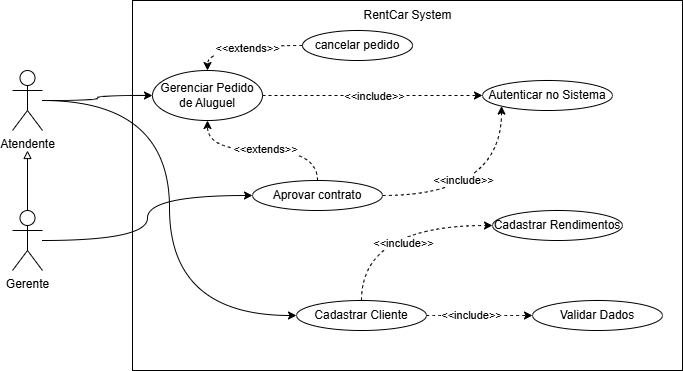
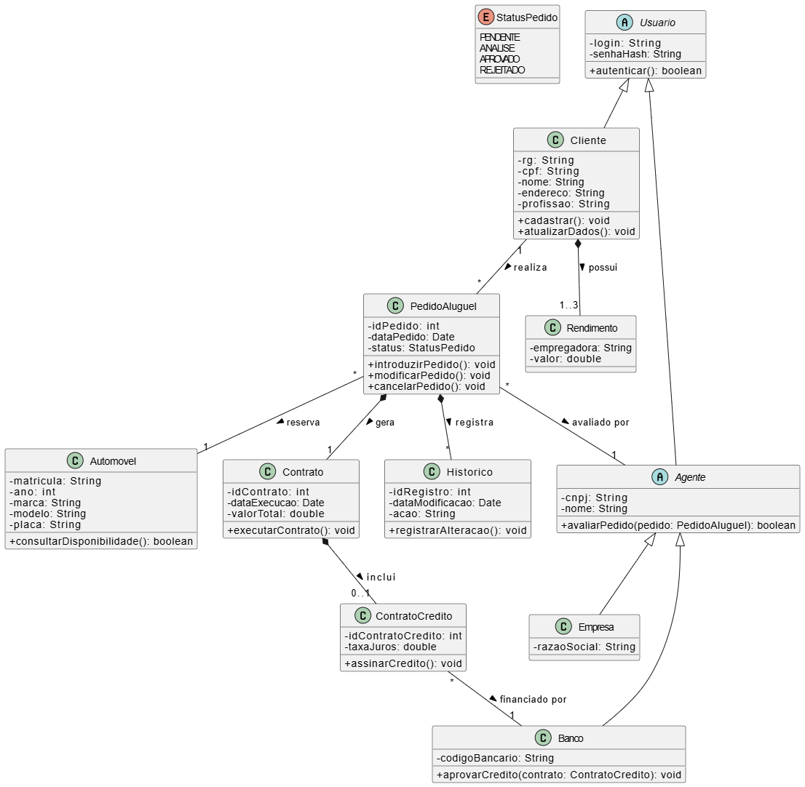
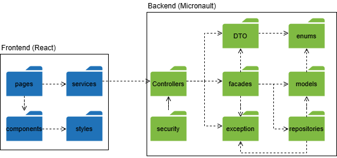
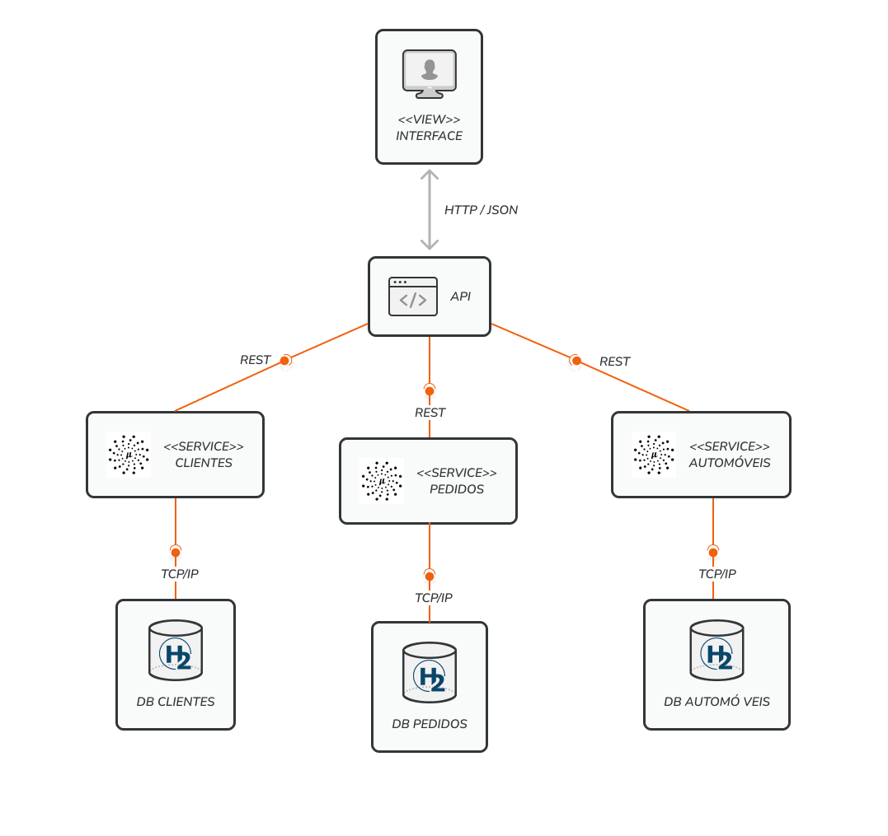

<div align="center">
  
</div>

<h1 align="center">Sistema de Aluguel de Carros</h1>

<div align="center">


**Laboratório de Desenvolvimento de Software — PUC Minas**

*Engenharia de Software · Prof. João Paulo Carneiro Aramuni*

</div>

---

## 📋 Sobre o Projeto

Aplicação web para gestão completa de aluguéis de automóveis, desenvolvida como projeto acadêmico na disciplina de **Laboratório de Desenvolvimento de Software** da PUC Minas.

O sistema permite que clientes realizem, modifiquem e cancelem pedidos de aluguel, enquanto agentes financeiros (empresas e bancos) avaliam e liberam contratos de crédito. O acesso à plataforma exige cadastro prévio com autenticação e controle de permissões.

### Atores do Sistema

| Ator | Permissões |
|---|---|
| **Cliente** | Introduzir, modificar, consultar e cancelar pedidos. |
| **Agente** (Empresa/Banco) | Modificar e avaliar pedidos financeiramente para liberar contratos. |

### Entidades Principais

- **Contratante** — RG, CPF, Nome, Endereço, Profissão, Empregadoras e até 3 rendimentos.
- **Automóvel** — Matrícula, Ano, Marca, Modelo, Preço por dia e Placa.
- **Contrato de Crédito** — Associado aos bancos e agentes financeiros após aprovação do pedido.

---

## 🏗️ Arquitetura

O sistema segue o padrão arquitetural **Cliente-Servidor via API RESTful**, dividido em duas camadas principais totalmente desacopladas:

- **Frontend (SPA)** — Interface rica e interativa construída com React.
- **Backend (API)** — Lógica de domínio, regras de negócio e persistência ultra-rápida com Micronaut.

```text
┌─────────────────────────────────────────┐
│              Frontend Web               │
│        (React / Framer / Tailwind)      │
└────────────────────┬────────────────────┘
                     │ HTTP / REST / JSON
┌────────────────────▼────────────────────┐
│              Servidor API               │
│  ┌──────────────┐  ┌──────────────────┐ │
│  │  Security    │  │   Controllers    │ │
│  └──────────────┘  └────────┬─────────┘ │
│                             │           │
│                ┌────────────▼─────────┐ │
│                │   Facades / Services │ │
│                └────────────┬─────────┘ │
│                             │           │
│                ┌────────────▼─────────┐ │
│                │  Micronaut Data (DB) │ │
│                └──────────────────────┘ │
└─────────────────────────────────────────┘
```

---

## 🛠️ Tecnologias Utilizadas

### Backend

- **Java 17+** — Linguagem principal
- **Micronaut Framework** — Framework de alta performance e baixo consumo de memória
- **Micronaut Data** — Camada de persistência e repositórios
- **Micronaut Security (JWT)** — Autenticação e controle de rotas por perfis (`ROLE_CLIENTE`, `ROLE_EMPRESA`, `ROLE_BANCO`)

### Frontend

- **React.js** — Biblioteca de UI
- **Tailwind CSS** — Estilização de utilitários
- **Framer Motion** — Animações fluidas de interface
- **Axios** — Consumo da API REST

---

## 📦 Entregas por Sprint

### ✅ Lab02S01 — Sprint 1: Modelagem UML

> **Foco:** Levantamento de requisitos e modelagem do sistema.

#### Diagrama de Casos de Uso



#### 👤 Histórias de Usuário (User Stories)

**US01 — Cadastro de Cliente**

> Como um usuário não registrado, quero me cadastrar no sistema fornecendo meus dados de identificação e financeiros, para que eu tenha permissão de utilizar os serviços de aluguel.

**Regra de Negócio:** O cadastro deve armazenar obrigatoriamente RG, CPF, Nome, Endereço, Profissão, entidades empregadoras e os rendimentos auferidos (limitado ao máximo de 3).

---

**US02 — Introdução de Pedido**

> Como um cliente cadastrado, quero introduzir um novo pedido de aluguel no sistema, para solicitar a locação de um automóvel.

**Regra de Negócio:** O pedido deve ficar pendente de análise financeira e de disponibilidade pela empresa logo após a introdução.

---

**US03 — Gestão Própria de Pedidos (Cliente)**

> Como um cliente, quero consultar, aceitar revisões, modificar ou cancelar meus pedidos de aluguel ativos, para ter controle total sobre as minhas solicitações na plataforma.

---

**US04 — Avaliação Financeira (Agente)**

> Como um agente (empresa ou banco), quero analisar os pedidos introduzidos, para emitir um parecer (positivo ou negativo) sobre a execução do contrato.

---

**US05 — Modificação de Pedidos (Agente)**

> Como um agente (empresa ou banco), quero poder modificar os pedidos de aluguel (sugerir novas datas), para realizar ajustes de disponibilidade antes da aprovação.

---

**US06 — Concessão de Crédito e Propriedade**

> Como um agente bancário, quero associar um contrato de crédito aprovado ao aluguel de um automóvel, para financiar a operação do cliente.

---

#### Diagrama de Classes



#### Diagrama de Pacotes



---

### 🔄 Lab02S02 — Sprint 2: Componentes e CRUD do Cliente

> **Foco:** Diagrama de Componentes e implementação do CRUD do cliente.

#### Diagrama de Componentes



#### Implementação do Frontend/Backend

- API RESTful desenvolvida com Micronaut.
- Telas de cadastro dinâmico baseadas em perfis com Hook Form e Zod no React.

---

### 🔄 Lab02S03 — Sprint 3: Implantação e Protótipo Final

> **Foco:** Diagrama de Implantação e protótipo funcional com criação e visualização de pedidos.

#### Diagrama de Implantação


#### Protótipo Final

- Motor de Prevenção de Overbooking no Java.
- Calendário Premium unificado no React exibindo dias disponíveis/bloqueados em tempo real.
- Fluxo completo de aprovação (Cliente → Empresa → Banco).

---

## 🚀 Como Rodar o Projeto

### Pré-requisitos

- Java 17+
- Node.js 18+ (para o Frontend)
- Maven 3.8+

### Executando o Backend (Micronaut)

```bash
# Clone o repositório
git clone https://github.com/seu-usuario/seu-repositorio.git

# Acesse o diretório do backend
cd seu-repositorio/backend

# Instale as dependências e inicie o servidor
./mvnw mn:run
```

A API estará disponível em `http://localhost:8080`.

### Executando o Frontend (React)

```bash
# Acesse o diretório do frontend
cd seu-repositorio/frontend

# Instale as dependências
npm install

# Inicie o servidor de desenvolvimento
npm run dev
```

A aplicação web estará disponível em `http://localhost:5173`.
